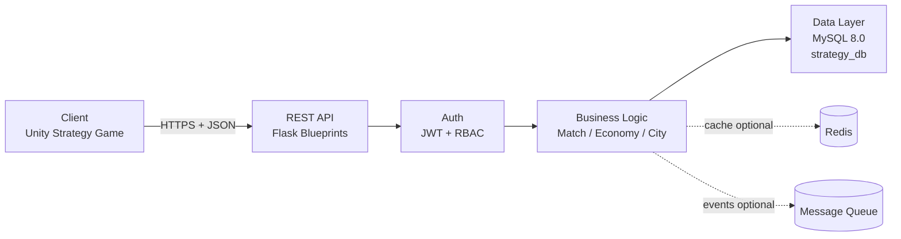

# 2. Практика. 1. Архитектура

**Проект:** strategy-support-is  
**Жанр:** Strategy  
**Клиент:** Unity Strategy Game / Web (test_client.html)  
**Backend:** Flask + MySQL 8.0  
**Дата:** 2026-02-27

---

## 1.1. Задание к разделу «Архитектура»

### 1.1.1. Цель

Спроектировать и описать архитектуру ИС сопровождения стратегической игры.
Клиент отправляет факты о прохождении (матч, события, прогресс), сервер валидирует данные,
рассчитывает награды, сохраняет изменения атомарно и возвращает результат.

---

## 1.2. Архитектурная схема

### 1.2.1. Схема (Mermaid)



### 1.2.2. Пояснение к архитектуре

**Client** — Unity-клиент или HTML-страница `test_client.html`. Отправляет запросы по HTTPS с JSON-телом и заголовком `Authorization: Bearer <JWT>`. Клиент присылает только факты (`matchId`, `isWin`, `score`, `durationSeconds`), но **не присылает** расчётные значения наград.

**REST API (Flask Blueprints)** — точка входа, реализован в `app/routes/`: `auth_bp`, `match_bp`, `events_bp`, `profile_bp`, `leaderboard_bp`, `health_bp`. Каждый запрос проходит через конвейер: `requestId → authJwt → validate → controller`.

**Auth (JWT + RBAC)** — middleware `app/middleware/auth_jwt.py`, декоратор `@auth_required(roles=[...])`. Вызывает `verify_jwt_in_request()`, извлекает `userId` и список ролей из claims токена, кладёт в `g.user`. Допустимые роли для игровых endpoint'ов: `player`.

**Business Logic** — папка `app/services/`. `match_service.py` рассчитывает награды (`_XP_WIN=100`, `_XP_LOSS=30`, `_SOFT_WIN=50`, `_SOFT_LOSS=10`), проверяет владение матчем, блокирует строку прогресса и управляет транзакцией. `auth_service.py` хэширует пароли через `bcrypt`. `events_service.py` реализует дедупликацию через таблицу `processed_events`.

**Data Layer (MySQL 8.0, strategy_db)** — доступ через `app/repositories/` с SQLAlchemy `text()`. Ядро: `users`, `roles`, `user_roles`, `game_sessions`, `game_events`, `player_progress`, `statistics_daily`, `leaderboard_scores`. Жанровые таблицы: `matches`, `battle_results`, `army_units`, `city_buildings`, `processed_events`.

**Redis (optional)** — кэш профилей и лидербордов. В текущей реализации не используется, обозначен как точка масштабирования.

**Message Queue (optional)** — асинхронная обработка событий аналитики и античит. В текущей реализации не используется.

---

## 1.3. Описание серверного сценария

### 1.3.1. Выбранный endpoint

`POST /api/v1/match/finish`

Реализован в:
- `app/routes/match.py` — маршрут и middleware-декораторы
- `app/controllers/match_controller.py` — HTTP-адаптер
- `app/services/match_service.py` — бизнес-логика и транзакция
- `app/repositories/matches_repo.py` — SQL матча и результата
- `app/repositories/progress_repo.py` — SQL прогресса игрока
- `app/repositories/stats_repo.py` — SQL дневной статистики
- `app/repositories/leaderboard_repo.py` — SQL лидерборда

---

## 1.4. HTTP-запрос

```http
POST /api/v1/match/finish
Authorization: Bearer <JWT>
Content-Type: application/json
```

```json
{
  "matchId": 9,
  "result": {
    "isWin": true,
    "score": 1850,
    "durationSeconds": 1200,
    "powerDelta": 50
  }
}
```

> Матч `id=9` принадлежит пользователю `alice` (user_id=1) и имеет статус `started` — именно он используется для тестирования согласно `seed.sql`.

---

## 1.5. Auth (JWT + RBAC)

Декоратор `@auth_required(roles=["player"])` в `app/routes/match.py`:

1. Вызывает `verify_jwt_in_request()` из `flask-jwt-extended`
2. Извлекает `userId` через `get_jwt_identity()`
3. Извлекает `roles` из claims через `get_jwt()`
4. Проверяет наличие роли `player` в списке ролей пользователя
5. Записывает `g.user = {"userId": ..., "roles": [...]}` для контроллера и логирования

**Возможная ошибка:**

```http
401 Unauthorized
```

```json
{
  "ok": false,
  "error": {
    "code": "UNAUTHORIZED",
    "message": "JWT is missing/invalid/expired",
    "requestId": "req_a1b2c3d4"
  }
}
```

---

## 1.6. Validation

Декоратор `@validate_match_finish` в `app/middleware/validate_api.py` выполняет проверки до обращения к БД:

- `matchId` — обязательный, тип `int`
- `result` — обязательный, объект
- `result.isWin` — обязательный, `bool`
- `result.score` — обязательный, `int >= 0`
- `result.durationSeconds` — обязательный, `int >= 0`
- `result.powerDelta` — опциональный, `int` или `null`

**Возможная ошибка:**

```http
400 Bad Request
```

```json
{
  "ok": false,
  "error": {
    "code": "VALIDATION_ERROR",
    "message": "Invalid request body",
    "requestId": "req_a1b2c3d4",
    "details": { "result.score": "int >= 0 required" }
  }
}
```

---

## 1.7. Business Logic

`app/services/match_service.py` выполняет следующую последовательность:

1. `ensure_match_ownership_started()` — проверяет, что матч существует, принадлежит `userId` из JWT и его `status = 'started'`
2. Рассчитывает награды на стороне сервера (клиент их не присылает):

```text
xp_gained   = 100  (isWin = true)  / 30  (isWin = false)
soft_gained = 50   (isWin = true)  / 10  (isWin = false)
```

3. Запускает транзакцию через `db.session`, выполняя все шаги атомарно
4. При любом исключении — `db.session.rollback()`

Клиент не является источником истины: поля `xpGained` и `softCurrencyGained` в запросе отсутствуют — сервер рассчитывает их по константам в `match_service.py`.

---

## 1.8. Data Layer (MySQL, транзакция)

### 1.8.1. Начало транзакции

```text
START TRANSACTION;
```

### 1.8.2. SQL-запросы

```sql
-- 1) Проверка матча (matches_repo.py — ensure_match_ownership_started)
SELECT id, user_id, status
FROM matches
WHERE id = 9;
```

```sql
-- 2) Закрытие матча (matches_repo.py — finish_match_row)
UPDATE matches
SET status   = 'finished',
    ended_at = NOW(3)
WHERE id = 9;
```

```sql
-- 3) Запись результата (matches_repo.py — finish_match_row)
INSERT INTO battle_results (match_id, is_win, score, duration_seconds)
VALUES (9, 1, 1850, 1200)
ON DUPLICATE KEY UPDATE
  is_win           = VALUES(is_win),
  score            = VALUES(score),
  duration_seconds = VALUES(duration_seconds);
```

```sql
-- 4) Блокировка прогресса от конкурентных запросов (progress_repo.py — lock_progress_row)
SELECT user_id, xp, soft_currency
FROM player_progress
WHERE user_id = 1
FOR UPDATE;
```

```sql
-- 5) Начисление наград (progress_repo.py — add_progress_rewards)
UPDATE player_progress
SET xp            = xp + 100,
    soft_currency = soft_currency + 50
WHERE user_id = 1;
```

```sql
-- 6) Дневная статистика upsert (stats_repo.py — upsert_daily_stats)
INSERT INTO statistics_daily
  (user_id, day, sessions_count, events_count, playtime_seconds, wins, losses, score_sum)
VALUES (1, CURDATE(), 0, 1, 1200, 1, 0, 1850)
ON DUPLICATE KEY UPDATE
  events_count     = events_count + 1,
  playtime_seconds = playtime_seconds + VALUES(playtime_seconds),
  wins             = wins + VALUES(wins),
  losses           = losses + VALUES(losses),
  score_sum        = score_sum + VALUES(score_sum);
```

```sql
-- 7) Лидерборд upsert (leaderboard_repo.py — upsert_leaderboard_score)
INSERT INTO leaderboard_scores (user_id, board_code, season, score)
VALUES (1, 'default', 1, 1850)
ON DUPLICATE KEY UPDATE
  score      = GREATEST(score, VALUES(score)),
  updated_at = CURRENT_TIMESTAMP(3);
```

### 1.8.3. Завершение транзакции

```text
COMMIT;
```

При исключении: `db.session.rollback()` в блоке `except Exception` в `match_service.py`.

---

## 1.9. JSON-ответ сервера

```http
HTTP/1.1 200 OK
Content-Type: application/json
X-Request-Id: req_a1b2c3d4
```

```json
{
  "ok": true,
  "data": {
    "matchId": 9,
    "isWin": true,
    "xpGained": 100,
    "softCurrencyGained": 50
  }
}
```

---

## 1.10. Возможные ошибки

### 1.10.1. 401 Unauthorized

Причина: токен отсутствует в заголовке `Authorization`, истёк срок действия или подпись невалидна.

### 1.10.2. 403 Forbidden

Причина: матч найден, но его `user_id` не совпадает с `userId` из JWT — попытка завершить чужой матч.

### 1.10.3. 404 Not Found

Причина: переданный `matchId` не существует в таблице `matches`.

### 1.10.4. 409 Conflict

Причина: матч найден и принадлежит пользователю, но его `status` не равен `started` — матч уже завершён или заброшен.

---

## 1.11. Архитектурные принципы проекта

1. **Сервер — источник истины.** Клиент присылает только факты (`score`, `isWin`), сервер рассчитывает награды по константам в `match_service.py`.
2. **Транзакции.** Все изменения при `match_finish` атомарны: `db.session.commit()` или `db.session.rollback()`.
3. **Stateless REST.** Состояние хранится в БД и JWT, не в памяти сервера. Каждый запрос самодостаточен.
4. **Разделение слоёв.** `routes` — только HTTP; `controllers` — только адаптер; `services` — бизнес-логика; `repositories` — только SQL.
5. **Защита от гонок.** `SELECT ... FOR UPDATE` на `player_progress` в `lock_progress_row()`.
6. **Дедупликация событий.** Таблица `processed_events` с `UNIQUE(user_id, event_id)` — повторный `eventId` возвращает `409 EVENT_REJECTED`.

---

## 1.12. Итог

Архитектура соответствует модели Client → API → Auth → Business Logic → DB:

- серверная валидация реализована через декораторы `@validate_match_finish` и `@auth_required`
- целостность данных обеспечена транзакцией с rollback при любом исключении
- RBAC реализован через JWT claims и `@auth_required(roles=[...])`
- масштабируемость предусмотрена: Redis и MQ обозначены как optional-компоненты
